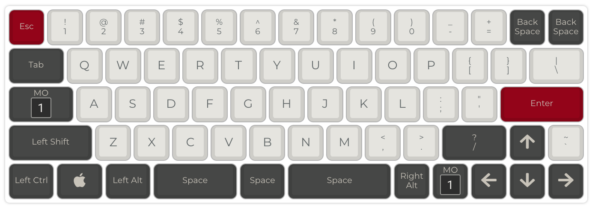
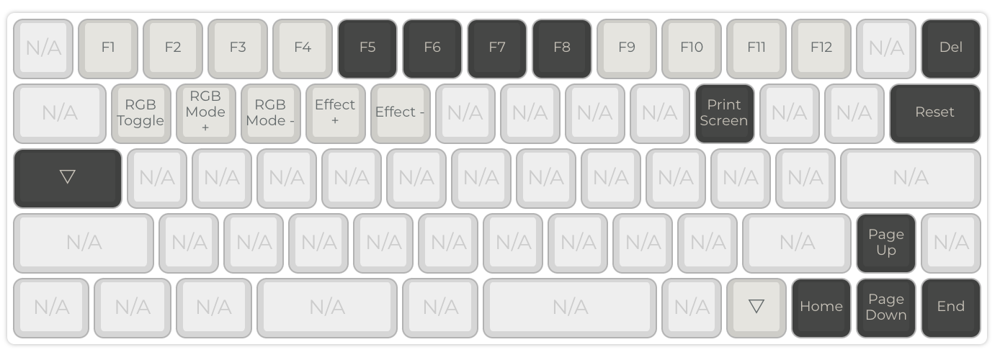

# 60% ANSI with Arrows (Mark 5)

Firmware for [Nemo's Mark 5](https://armno.in.th/2019/05/01/custom-mechanical-keyboard-build-2/#mark-5). 
Made with DZ60 Rev 3.

See [firmware.json](./firmware.json).

Layer 0: <kbd>/</kbd> is 1.75U

Layer 1:

