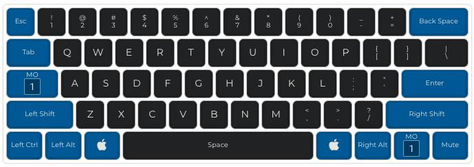
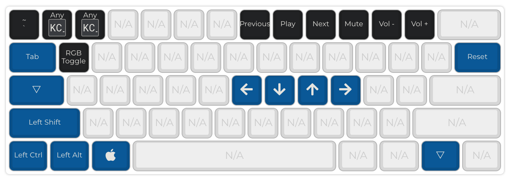

# 60% ANSI

Standard ANSI 60% layout for my [Mark 4.2](https://armno.in.th/2019/05/01/custom-mechanical-keyboard-build-2/#mark-4). Made with DZ60 Rev 2.

See [firmware.json](./firmware.json).

Layer 0:

Layer 1:

