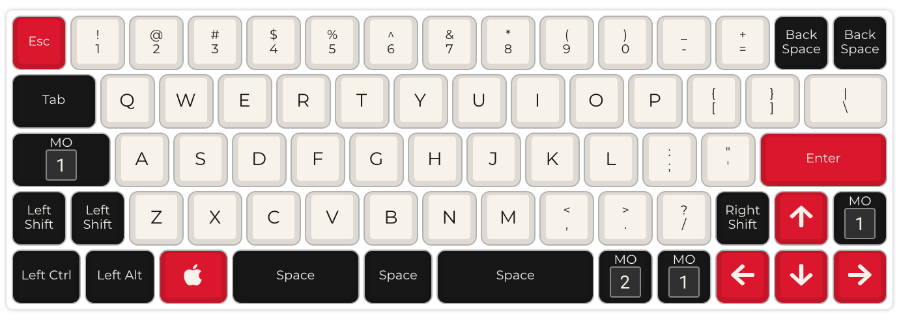
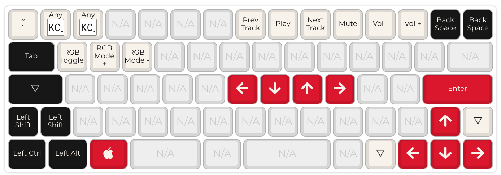
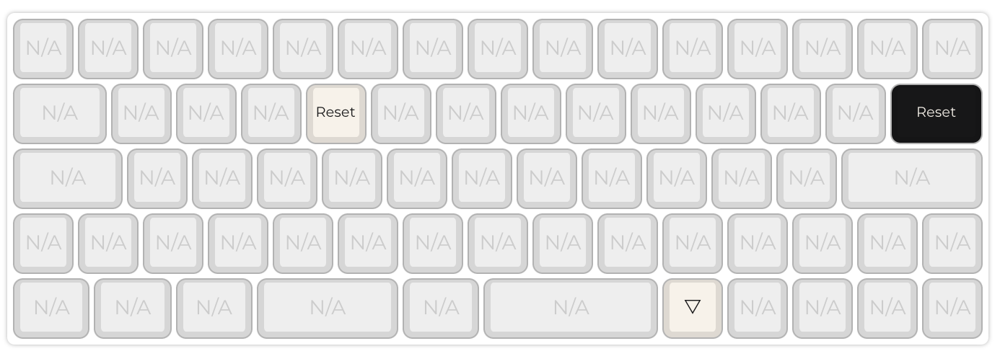

# 60% ANSI with Arrows and Split Spacebar

Standard ANSI 60% layout for my [Mark 4.1](https://armno.in.th/2019/06/08/60-percent-mechanical-keyboard-with-arrows/). Made with DZ60 Rev 2 without a plate.

Note that this keyboard has **2U left shift** instead of 2.25U.

See [firmware.json](./firmware.json).

Layer 0:

Layer 1:

Layer 2: just to keep the `RESET` button away from other layers.

