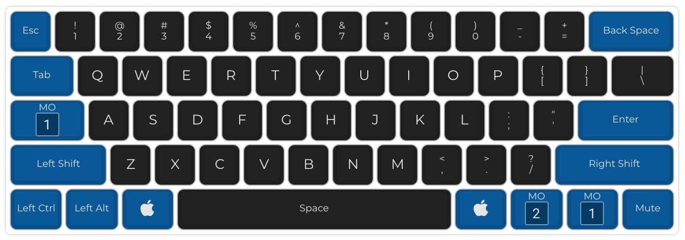
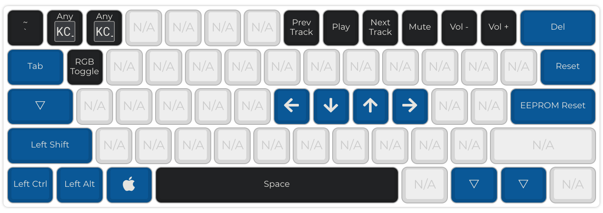
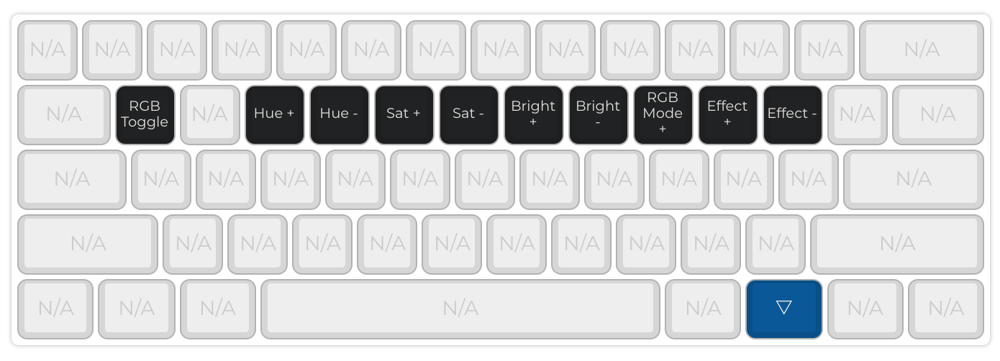

# DZ60RGB with ANSI layout

Another standard ANSI layout specifically for this PCB: [DZ60RGB-ANSI](https://kbdfans.com/collections/60/products/dz60rgb-ansi-mechanical-keyboard-pcb) from KBDFans.

Keymappings are almost the same with the [dz60-ansi](https://github.com/armno/keyboard-firmwares/tree/master/dz60-ansi). The differences are:

- there is `LAYER2`  just for RGB controls
- `RALT` is replaced with `MO(2)`
- `EEPROM Reset` key is added

Layer 0:

Layer 1:

Layer 2:

