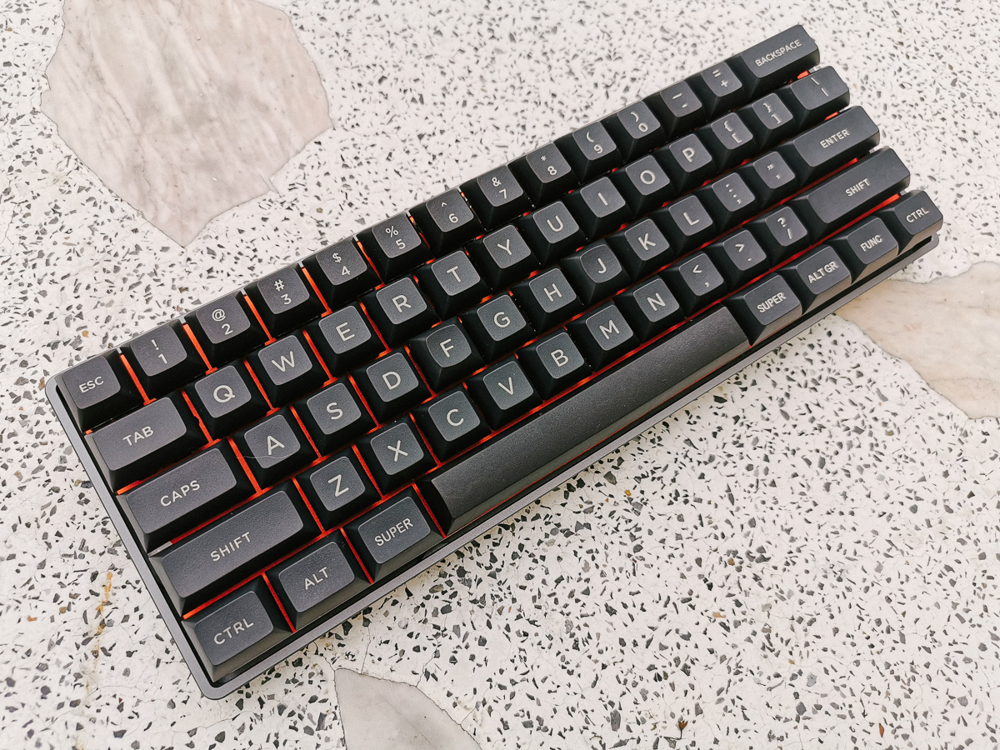
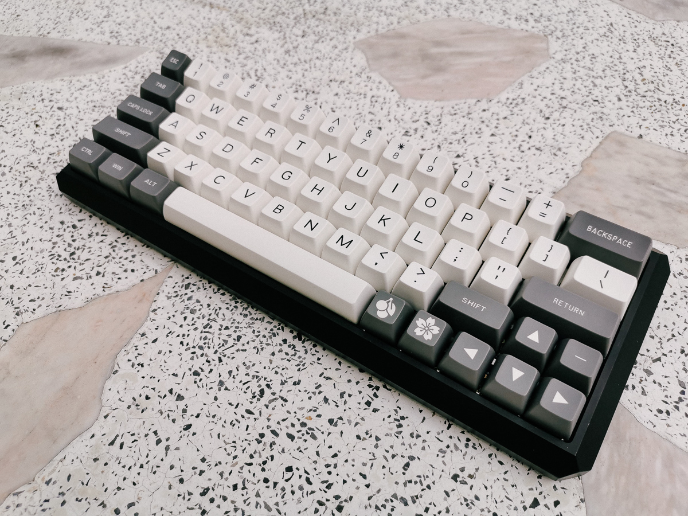
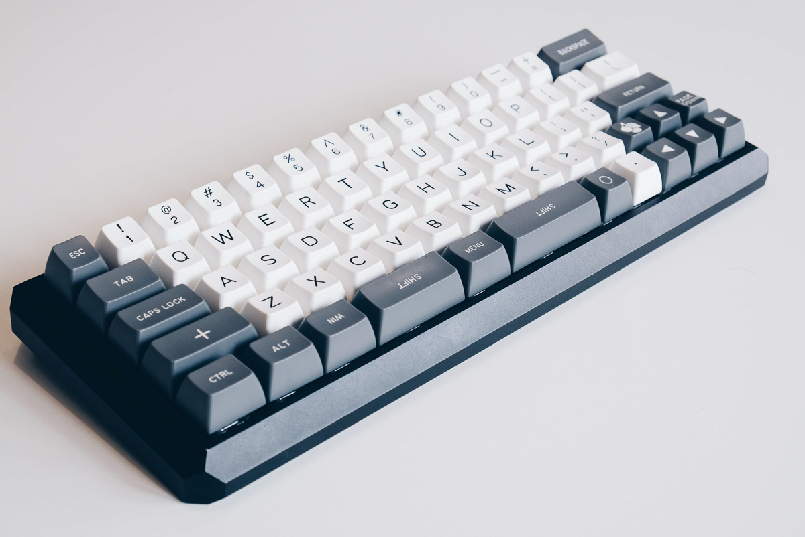

# Custom Keyboard Firmware

My customized QMK firmware for my [mechanical keyboards](https://armno.in.th/2019/05/01/custom-mechanical-keyboard-build-2/).

Create with [QMK Configurator](https://config.qmk.fm) to use with [QMK Toolbox](https://github.com/qmk/qmk_toolbox) app.

## Keyboards

- [Mark 4.1: 60% ANSI](./dz60-ansi/readme.md) - standard 60% ANSI layout

- [Mark 5: 60% ANSI with Arrows](./dz60-ansi-arrows/readme.md) - 60% ANSI with arrow keys at the bottom right corner.

- [Mark 4.1: 60% ANSI with Arrows and Split Spacebar](./dz60-arrows-split-spacebar/readme.md) - Basically Mark 5 but with split spacebar and 2U left shift.

